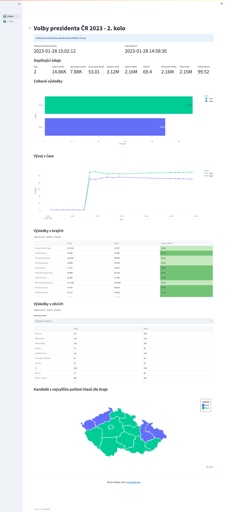

# Volby 2023

Frontend of the application presenting live results for 2023 Czech presidential elections.

Application uses Streamlit framework. It connects to the database and automatically refreshes the data every 2 minutes.

The app was hosted in Azure using Azure Web App. After the elections it runs only using Streamlit cloud - https://romanzdk.com/volby

